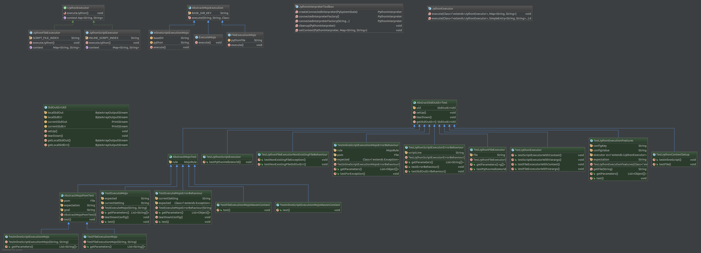

[](https://travis-ci.org/juergen-rocks/jython-maven-plugin)
[](https://coveralls.io/github/juergen-rocks/jython-maven-plugin?branch=master)
[](https://raw.githubusercontent.com/juergen-rocks/jython-maven-plugin/master/LICENSE)
[](https://github.com/juergen-rocks/jython-maven-plugin/issues)
[](https://github.com/juergen-rocks/jython-maven-plugin/network)

# jython-maven-plugin

A simple maven plugin to run python scripts during maven build – you can now use python 2.7 scripts within a maven run.

You can use the complete standard library that comes with Jython 2.7.

## Dependencies for your project

```xml
<plugin>
    <groupId>rocks.juergen</groupId>
    <artifactId>jython-maven-plugin</artifactId>
    <version>${jython-maven-plugin.version}</version>
    <configuration>
        <!-- See configuration details -->    
    </configuration>
</plugin>
```

By default, the plugin is bound to the `generate-resources` phase. With the `<execution>` tag, you can bind it to other phases.

## Using inline script in POM

The easiest use case is the usage of an inline script, directly included in your POM. Example:

```xml
<build>
    <plugins>
        <plugin>
            <groupId>rocks.juergen</groupId>
            <artifactId>jython-maven-plugin</artifactId>
            <version>${jython-maven-plugin.version}</version>
            <configuration>
                <python><![CDATA[
for i in range(3):
    print 'hello, world!'
                ]]></python>    
            </configuration>        
        </plugin>
    </plugins>
</build>
```

Remark: Due to python's need for correct indentation, your inline python code must begin at the «real» beginning of the line.

Also, using `CDATA` is a good practise to keep your POM valid and clean.

If you have only a single line in your inline script, you can simply to this:

```xml
<python><![CDATA[print 'hello, world!']]></python>
```

## Using script file

## Executing scripts directly

# Project information

## License

## Issue tracker

## Pull Requests

## Class Diagram Overview

[](./doc/class-diagram.png)